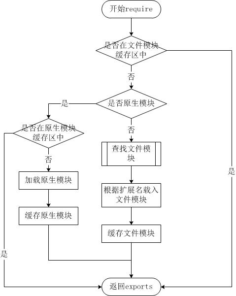

# node-note
node学习笔记

## 2018-10-10 笔记

### 1. node 创建第一个应用
node 应用是由以下3部分组成：

1. **引入 required 模块：** 使用 required 指令载入 node 模块
2. **创建服务器：** 服务器可以监听客户端请求
3. **接收请求与相应请求：** 服务器很容易创建，客户端可以使用浏览器或终端发送 HTTP 请求，服务器接收请求后返回响应数据

### 2. node 回调函数
node 异步编程的直接体现就是回调

node 所有 API 都支持回调函数

阻塞模式是按顺序执行，而非阻塞是不按循序执行

### 3. node 事件循环
node 基本上所有机制都是用设计模式中的**观察者模式**实现

node 单线程类似进入一个 **while(true)** 的事件循环，直到没有事件观察者退出，每个异步事件都生成一个事件观察者，如果有事件发生就调用该回调函数

### 4. node EventEmitter
node 所有的异步 I/O 操作在完成时都会发送一个事件到事件队列

events 模块只提供了一个对象： events.EventEmitter

EventEmitter 的核心就是 **事件触发** 与 **事件监听器** 功能的封装

EventEmitter 的每个事件由 **一个事件名** 和 **若干个参数** 组成，事件名是一个字符串

常用 API 说明

| API    | 描述          |            
| :----: | ------------- |
|once(event, listener)|为指定事件注册一个单次监听器，即 监听器最多只会触发一次，触发后立刻解除该监听器|
|removeListener(event, listener)|移除指定事件的某个监听器，监听器必须是该事件已经注册过的监听器<br>它接受两个参数，第一个是事件名称，第二个是回调函数名称|
|removeAllListeners([event])|移除所有事件的所有监听器， 如果指定事件，则移除指定事件的所有监听器|
|setMaxListeners(n)|默认情况下， EventEmitters 如果你添加的监听器超过 10 个就会输出警告信息 setMaxListeners 函数用于提高监听器的默认限制的数量|
|listeners(event)|返回指定事件的监听器数组|

类方法

| API    | 描述          |            
| :----: | ------------- |
|listenerCount(emitter, event)|返回指定事件的监听器数量|

大多数时候我们不会直接使用 EventEmitter，而是在对象中继承它。包括 fs、net、 http 在内的，只要是支持事件响应的核心模块都是 EventEmitter 的子类

原因有两点：
>1. 具有某个实体功能的对象实现事件符合语义， 事件的监听和发生应该是一个对象的方法。
>2. JavaScript 的对象机制是基于原型的，支持部分多重继承，继承 EventEmitter 不会打乱对象原有的继承关系。

### 5. node Buffer

### 6. node Stream
node Stream 有四种流类型：
>1. Readable - 可读操作。
>2. Writable - 可写操作。
>3. Duplex - 可读可写操作.
>4. Transform - 操作被写入数据，然后读出结果。

所有的 Stream 对象都是 EventEmitter 的实例。常用的事件有：
>1. data - 当有数据可读时触发。
>2. end - 没有更多的数据可读时触发。
>3. error - 在接收和写入过程中发生错误时触发。
>4. finish - 所有数据已被写入到底层系统时触发。

- **管道流：** 管道提供了一个输出流到输入流的机制。通常我们用于从一个流中获取数据并将数据传递到另外一个流中。

- **链式流：** 链式是通过连接输出流到另外一个流并创建多个流操作链的机制。链式流一般用于管道操作。

## 2018-10-11 笔记

### 7. node 模块系统
node 中存在 4 类模块（原生模块和3种文件模块），其加载优先级也各自不同。如下图所示：



#### 从文件模块缓存中加载
尽管原生模块与文件模块的优先级不同，但是都会优先从文件模块的缓存中加载已经存在的模块

#### 从原生模块加载
**原生模块** 的优先级仅次于 **文件模块缓存** 的优先级。require 方法在解析文件名之后，优先检查模块是否在原生模块列表中。以http模块为例，尽管在目录下存在一个 http/http.js/http.node/http.json 文件，require("http") 都不会从这些文件中加载，而是从原生模块中加载

原生模块也有一个缓存区，同样也是优先从缓存区加载。如果缓存区没有被加载过，则调用原生模块的加载方式进行加载和执行

#### 从文件加载
当文件模块缓存中不存在，而且不是原生模块的时候，Node.js 会解析 require 方法传入的参数，并从文件系统中加载实际的文件

require方法接受以下几种参数的传递：
- http、fs、path等，原生模块
- ./mod或../mod，相对路径的文件模块
- /pathtomodule/mod，绝对路径的文件模块
- mod，非原生模块的文件模块

### 8. 路由
node 会默认发送 /favicon.ico 请求，该请求是加载页面在浏览器收藏夹中的显示图标

可以通过如下代码禁止发送：
```javascript
let pathname = url.parse(request.url).pathname
if(pathname == '/favicon.ico'){
  return
}
```

### 9. GET/POST 请求
1. **GET请求：** 由于GET请求直接被嵌入在路径中，URL是完整的请求路径，包括了?后面的部分，因此你可以手动解析后面的内容作为GET请求的参数
2. **POST：** POST 请求的内容全部的都在请求体中，http.ServerRequest 并没有一个属性内容为请求体，原因是等待请求体传输可能是一件耗时的工作。因此，当需要的时候，需要手动来做

API解释：

**util.inspect(object[, options])**

`util.inspect()` 方法返回 `object` 的字符串表示，主要用于调试。 附加的 options 可用于改变格式化字符串的某些方面

- `object` \<any\> 任何 JavaScript 原始值或对象
- `options` \<object\>
  - `showHidden` \<boolean\> 如果为 true，则 object 的不可枚举的符号与属性也会被包括在格式化后的结果中。 默认为 false
  - `depth` \<number\> 指定格式化 object 时递归的次数。 这对查看大型复杂对象很有用。 默认为 2。 若要无限地递归则传入 null
  - `colors` \<boolean\> 如果为 true，则输出样式使用 ANSI 颜色代码。 默认为 false。 颜色可自定义
  - `customInspect` \<boolean\> 如果为 false，则 object 上自定义的 inspect(depth, opts) 函数不会被调用。 默认为 true
  - `showProxy` \<boolean\> 如果为 true，则 Proxy 对象的对象和函数会展示它们的 target 和 handler 对象。 默认为 false
  - `maxArrayLength` \<number\> 指定格式化时数组和 TypedArray 元素能包含的最大数量。 默认为 100。 设为 null 则显式全部数组元素。 设为 0 或负数则不显式数组元素
  - `breakLength` \<number\> 一个对象的键被拆分成多行的长度。 设为 Infinity 则格式化一个对象为单行。 默认为 60

**url.parse(urlString[, parseQueryString[, slashesDenoteHost]])**

`url.parse()` 方法会解析一个 `URL` 字符串并返回一个 URL 对象。

- `urlString` \<string\> 要解析的 URL 字符串
- `parseQueryString` \<boolean\> 如果为 true，则 query 属性总会通过 querystring 模块的 parse() 方法生成一个对象。 如果为 false，则返回的 URL 对象上的 query 属性会是一个未解析、未解码的字符串。 默认为 false
- `slashesDenoteHost` \<boolean\> 如果为 true，则 // 之后至下一个 / 之前的字符串会被解析作为 host。 例如，//foo/bar 会被解析为 {host: 'foo', pathname: '/bar'} 而不是 {pathname: '//foo/bar'}。 默认为 false

**querystring.parse(str[, sep[, eq[, options]]])**

该方法会把一个 URL 查询字符串 `str` 解析成一个键值对的集合

- `str` \<string\> 要解析的 URL 查询字符串
- `sep` \<string\> 用于界定查询字符串中的键值对的子字符串。默认为 '&'
- `eq` \<string\> 用于界定查询字符串中的键与值的子字符串。默认为 '='
- `options` \<Object\>

  - `decodeURIComponent` \<Function\> 解码查询字符串的字符时使用的函数。默认为 - querystring.unescape()
  - `maxKeys` \<number\> 指定要解析的键的最大数量。指定为 0 则不限制。默认为 1000

>该方法返回的对象不继承自 JavaScript 的 `Object` 类。 这意味着 `Object` 类的方法如 `obj.toString()`、`obj.hasOwnProperty()` 等没有被定义且无法使用

>默认情况下，查询字符串中的字符会被视为使用 UTF-8 编码。 如果使用的是其他字符编码，则需要指定 decodeURIComponent 选项，例如：

```javascript
// 假设存在 gbkDecodeURIComponent 函数。
querystring.parse('w=%D6%D0%CE%C4&foo=bar', null, null,
                  { decodeURIComponent: gbkDecodeURIComponent });
```

### 10. node 工具模块

|模块名|描述|
| :------: | --- |
|OS 模块|提供基本的系统操作函数|
|Path 模块|提供了处理和转换文件路径的工具|
|Net 模块|用于底层的网络通信。提供了服务端和客户端的的操作|
|DNS 模块|用于解析域名|
|Domain 模块|简化异步代码的异常处理，可以捕捉处理try catch无法捕捉的|

## 2018-10-12 笔记

### 11. Express 框架
Express 框架核心特性：
- 可以设置 `中间件` 来响应 HTTP 请求
- 定义了 `路由表` 用于执行不同的 HTTP 请求动作
- 可以通过向模板传递参数来动态渲染 HTML 页面

### 12. API 解释
**http.response.end**

结束响应，告诉客户端所有消息已经发送。当所有要返回的内容发送完毕时，该函数必须被调用一次。如何不调用该函数，客户端将永远处于等待状态。

response.end([data], [encoding])

- `data` -- `end()` 执行完毕后要输出的字符，如果指定了 `data` 的值，那就意味着在执行完 `response.end()` 之后，会接着执行一条 `response.write(data , encoding);`

- encoding -- 对应 `data` 的字符编码

### 13. POST 提交方式解释
**application/x-www-form-urlencoded**

最常见的 `POST` 提交数据的方式了。浏览器的原生 `form` 表单，如果不设置 `enctype` 属性，那么最终就会以 `application/x-www-form-urlencoded` 方式提交数据

提交的数据按照 `key1=val1&key2=val2` 的方式进行编码，`key` 和 `val` 都进行了 `URL` 转码

**Express post请求无法解析参数的原因**

**原因：** 因为 `post` 的是一个 `raw` 的字符串， `Express` 默认只支持 `json` 与 `x-www-form-urlencoded`

**解决方法：** 使用 `json` 对象与后台进行交互，或进行解码
